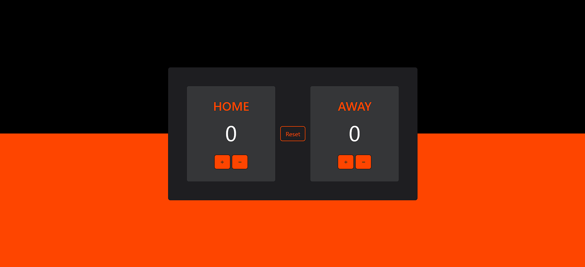

# basketball-scoreboard
 This project is a simple Score Counter web application built with HTML, CSS, JavaScript, and Bootstrap. The app allows users to increment, decrement, and reset scores for two categories: Home and Away.

## Features
- Increment and Decrement Scores: Users can increase or decrease the scores for both categories.
- Reset Button: Resets both scores to zero.
- Responsive Design: Styled with Bootstrap for a modern look and functionality.
- Interactive UI: Engaging buttons with icons for a smooth user experience.

## Technologies Used
- **HTML5**: For the structure of the web page.
- **CSS3**: For styling, including custom styles and responsive design.
- **JavaScript**: For interactive functionality and DOM manipulation.
- **Bootstrap 5**: For styling components and layout.
- **Bootstrap Icons**: For button icons (plus and minus).

## Installation and Usage
1. Clone the repository:
   ```bash
   git clone https://github.com/Yoki-28/basketball-scoreboard.git
2. Navigate to the project directory:
   ```bash
   cd score-counter
3. Open the index.html file in your web browser.

## Project Structure
  ```bash
  score-counter/
  ├── index.html       # Main HTML file
  ├── style.css        # CSS styles
  ├── script.js        # JavaScript logic
  ```

## How to Use
1. Open the application in your browser.
2. Click on the + or - buttons to adjust the scores for Home or Away.
3. Press the Reset button to reset both scores to zero.

## Demo


## Future Enhancements
- Add support for multiple teams.
- Implement a timer or countdown feature for game tracking.
- Persist scores using local storage or a backend API.

## Contact
Created by [Yogesh](https://github.com/Yoki-28) - feel free to reach out!